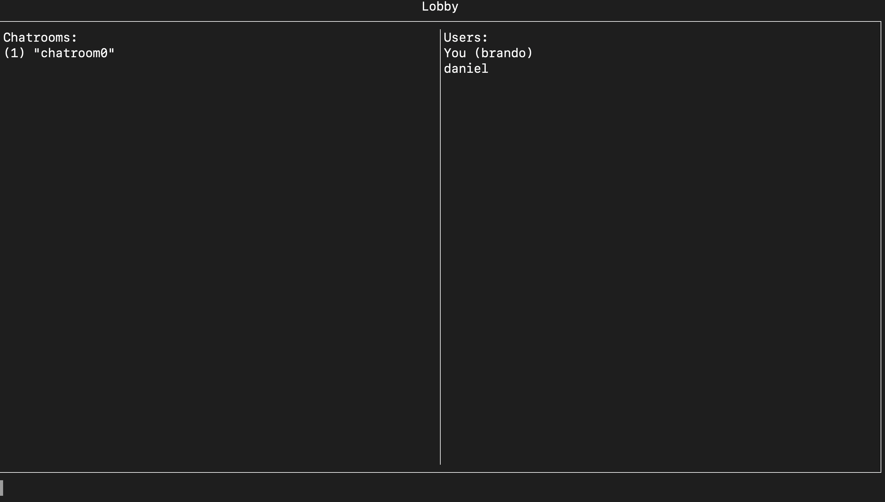
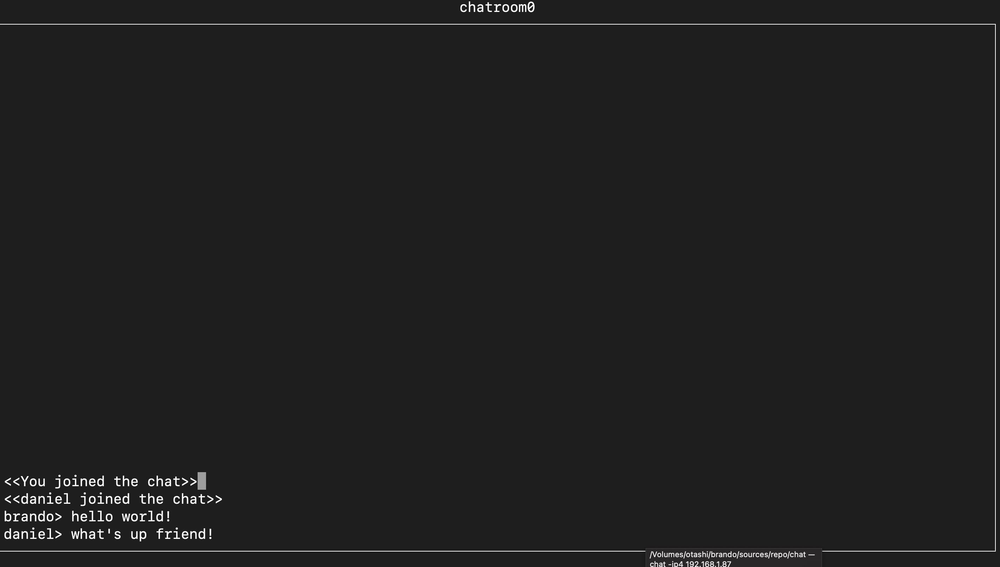

# Chat Server

## Supports
- Linux
- macOS

## Description
I always wanted to make a chat server. I want to make the experience easy such that people that want to chat can just use nc or telnet

## Usage
Lobby:

Chatroom:

- launch
	- as server: `chat server`
	- as client: `chat -ip4 <server's ip address>`
- for help, enter `help` command

## Development
- Dependencies
	- in `external/libs` run `make clean all`
	- in `external/openssl` run `./Configure;make;`
			
- Environment
	- `make` - build tool
	- `g++` - compiler
	- `vim` - file editor
- Debugging
	- run `make clean debug` and point your debugger to the product
- Supported OS
	- Linux (debian)
	- macOS (arm64)

